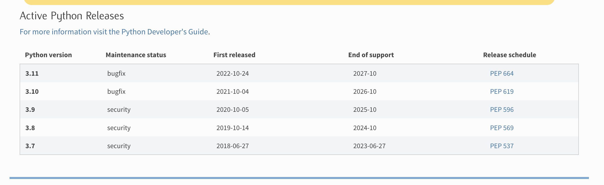

# Celery-Scraper
## Description

This project contains codeBase for scarping data from website using celery.

***
[](https://github.com/pre-commit/pre-commit)
***

# Django and Python Version for project.

    Django - 5.0.1
    Python - 3.11.3

***
## Installing python3.11.5 using pyenv

* The simplest and easiest way to install python3.11.5 along side your existing python version is using `pyenv`.

* Follow the instructions to install `pyenv`.
    [https://github.com/pyenv/pyenv#getting-pyenv](https://github.com/pyenv/pyenv#getting-pyenv)

* Fetch latest publications of python from remote into local
```shell
pyenv update
```
or

Run the command printed on the terminal.
When run the below command.
```shell
pyenv install 3.11.3
```

* Fetch the latest updates. Sample

```shell
cd /Users/deesh/.pyenv/plugins/python-build/../.. && git pull && cd -
```

***

## LTS support for Django.


***

## LTS support for Python



***

# Setting up Postgres in local

1. Install Postgres in your system.
   - [x][Postgres Installation for all Systems](https://www.timescale.com/blog/how-to-install-psql-on-mac-ubuntu-debian-windows/)


2.  Facing > django.db.utils.OperationalError: connection to server at "localhost" (127.0.0.1), port 5432 failed: FATAL:  password authentication failed for user "postgres"?. Follow below lines : 

    * Step 1: Check the status of the Postgres cluster.
    ```
    pg_lsclusters
    ```

    * Step 2: Restart the Postgres cluster
    ```
    sudo pg_ctlcluster 15 main start
    ```
    . Make sure to replace 15 with your version of Postgres.

    * Step 3: Check again and connect.
      ```
      pg_lsclusters
      ```
      ```
      sudo -i -u postgres
      ```
      ```
      psql
      ```
      
3. Facing > django.db.utils.OperationalError: connection to server at "localhost" (127.0.0.1), port 5432 failed: FATAL:  database "otolmsdbloc" does not exist. Facing this error?. Follow below steps:
      ```
      sudo -i u postgres
      ```
      ```
      CREATE DATABASE otolmsdbloc;
      ```
      ```
      ALTER USER postgres WITH PASSWORD 'postgres';
      ```


# Setting up Redis in local.

1. Install redis cache in the system

  * mac os

  ```commandline
  brew install redis
  ```
       
   * linux(any)

  ```commandline
  sudo apt-get install redis
  ```
       
  or

  ```commandline
  sudo snap install redis --classic
  ```
 
## OR 
       
2. Installing via docker
    * pull the latest docker redis server image.

      ```dockerfile
      docker run --name local-redis -p 6379:6379 -d redis
      ```

    * to check the server logs
   
      ```dockerfile
      docker logs local-redis
      ```

    * To loging into the redis server(for any reason)
      
      ```dockerfile
      docker exec -it local-redis redis-cli
      ```


***
# Dev Responses
- [x] [Django LTS versions](https://www.djangoproject.com/download/)
- [x] [Python LTS versions](https://www.python.org/downloads/)


[//]: # (## Test and Deploy)

***

# Sample Environment
Make a new (.env) file in your project directory and paste the below lines.
# list of keys to be present in the .env.

## we will keep it updating so that for future we won't loose the required keys.

```dotenv
DEBUG=True # make this into False in prod for sure
ENVIRONMENT=STAGE
SECRET_KEY=django-insecure-lw1w=x_dwlt7yzv@=-9w@n+xshxszxu&6wbf_@!b1g4k-l6&99# update this with some secure key in prod
# set the above config in production always
# notification database credential to be used for connection.
APM_KEY=
ELASTIC_APM_ENABLED=False

STAGE_DATABASE_NAME=
STAGE_DATABASE_USER=
STAGE_DATABASE_PASSWORD=
STAGE_DATABASE_HOST=
STAGE_DATABASE_PORT=
STAGE_REDIS_CACHE=
STAGE_REDIS_KEY_PREFIX=
STAGE_AWS_REGION_MUMBAI=
STAGE_AWS_ACCESS_KEY_ID=
STAGE_AWS_SECRET_ACCESS_KEY=
STAGE_AWS_PRIVATE_BUCKET_NAME=


# IF NEED ADD THE PROD RELATED CONFIG
PROD_DATABASE_NAME=
PROD_DATABASE_USER=oto
PROD_DATABASE_PASSWORD=
PROD_DATABASE_HOST=
PROD_DATABASE_PORT=
PROD_REDIS_CACHE=
PROD_REDIS_KEY_PREFIX=
PROD_AWS_REGION_MUMBAI=
PROD_AWS_ACCESS_KEY_ID=
PROD_AWS_SECRET_ACCESS_KEY=
PROD_AWS_PRIVATE_BUCKET_NAME=
```


# Setting up pre-commit hooks

* pre-commit hooks run when we are trying to commit change into the remote repo.
* This will be make sure the steps mentioned in the file `pre-commit-config.yaml` are run if any of the steps fails it will not allow us to commit the changes.
* install pre-commit hooks.
   * mac os

      ```commandline
      brew install pre-commit
      ```
   * linux(any)

     ```commandline
     snap install pre-commit --classic
     ```
   * windows/Any environment

     ```commandline
     python3 -m pip install pre-commit
     ```
     
* Configuring pre-commit hooks.

1. To configure the pre-commits hooks run the following command.
  
  * if you install via python3 method.
  
    ```commandline
    python3 -m pre_commit install
    ```
  
  * if you installed via apt or brew run the following command to install.
  
     ```commandline
     pre-commit install
     ```
    
  * For manually running the commit hooks without even staging the files.

      ```commandline
      pre-commit run --all-files
      ```

    ## or

  * python -m flag.

    ```commandline
    python3 -m pre_commit run --all-files
    ```


# Dev Note:


# Reason For addition of Packages.

* python-benedict
  * East to handle with the nested dictionaries
  * ref:: https://github.com/fabiocaccamo/python-benedict#keypath